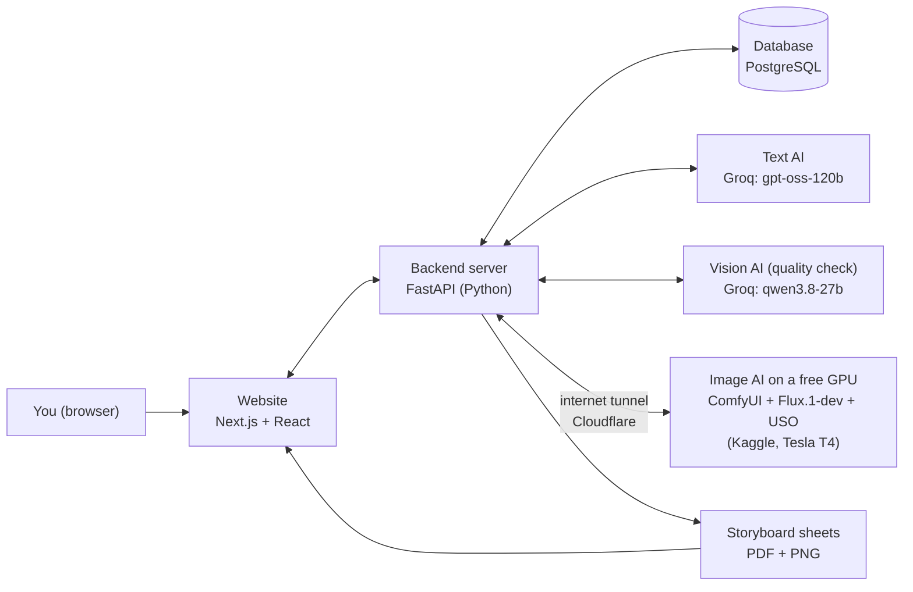
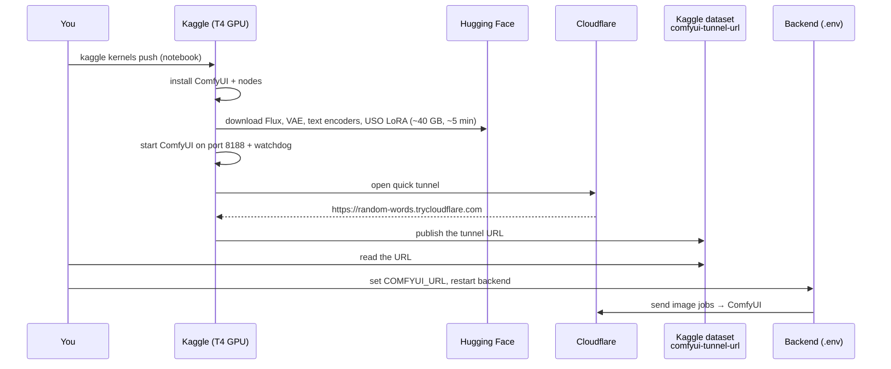
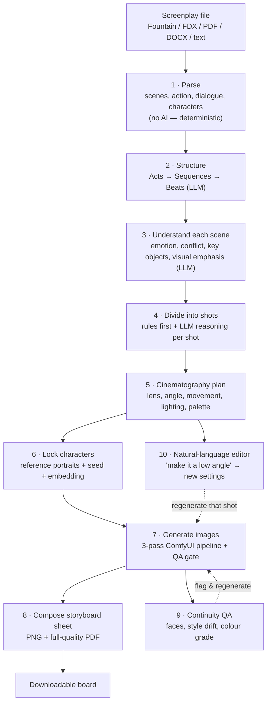
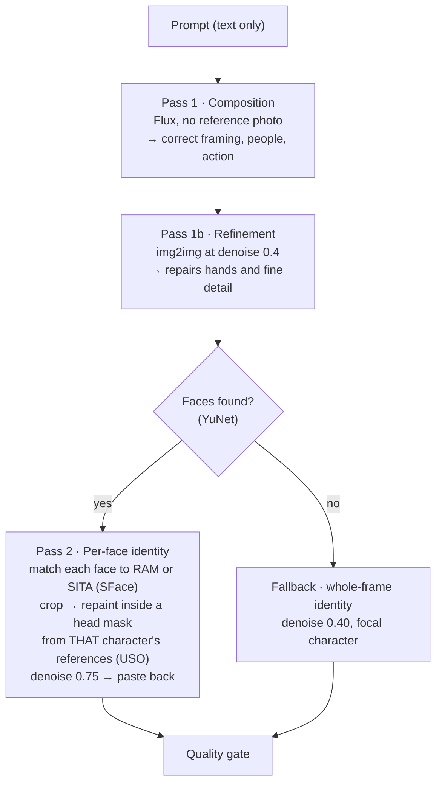
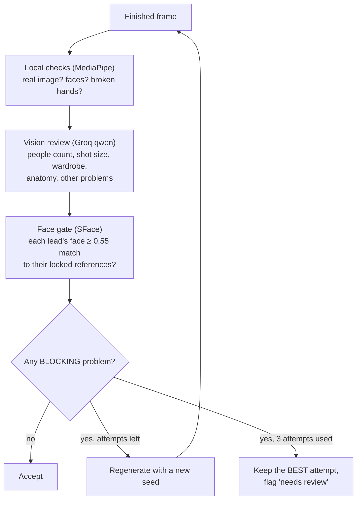
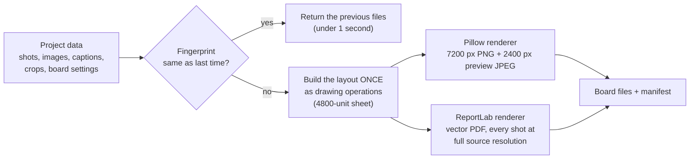
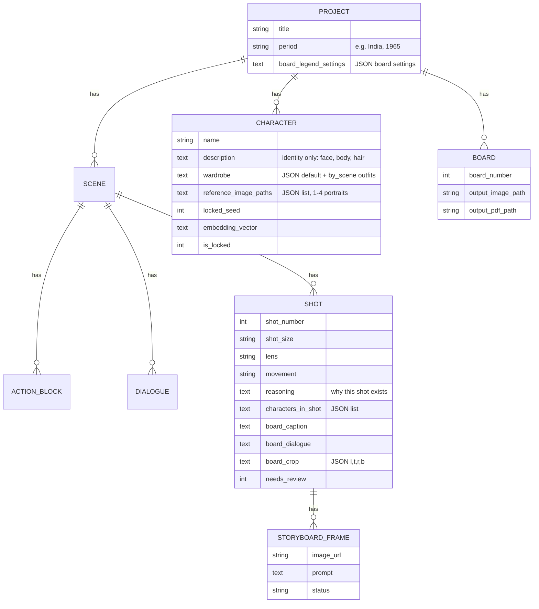

# 70MM.ai — Architecture & the Complete Project Story

*A beginner-friendly guide to what we built, how it works, why every piece was chosen, what went wrong, and how we fixed it.*

**Last updated:** 1 October 2026 · **Status:** working end to end (screenplay → shots → character-locked images → production storyboard sheet). For exact commands to install and run everything, see **[README.md](README.md)**: this document explains the *what* and the *why*; the README explains the *how to run*.

---

## Table of contents

1. [Who this is for and how to read it](#1-who-this-is-for-and-how-to-read-it)
2. [The big picture in five minutes](#2-the-big-picture-in-five-minutes)
3. [The building blocks (tech stack) and why we chose each one](#3-the-building-blocks-tech-stack-and-why-we-chose-each-one)
4. [How the pipeline works, stage by stage](#4-how-the-pipeline-works-stage-by-stage)
5. [Deep dive: making the pictures (Stage 7)](#5-deep-dive-making-the-pictures-stage-7)
6. [Deep dive: the production storyboard sheet (Stage 8)](#6-deep-dive-the-production-storyboard-sheet-stage-8)
7. [How the data is stored](#7-how-the-data-is-stored)
8. [The complete story, start to end](#8-the-complete-story-start-to-end)
9. [Every challenge we hit, and how we fixed it](#9-every-challenge-we-hit-and-how-we-fixed-it)
10. [Optimisations, with real numbers](#10-optimisations-with-real-numbers)
11. [Lessons learned (including the things we got wrong)](#11-lessons-learned-including-the-things-we-got-wrong)
12. [Licences, ethics and commercial risk](#12-licences-ethics-and-commercial-risk)
13. [Known issues and what is next](#13-known-issues-and-what-is-next)
14. [Where everything lives (file map)](#14-where-everything-lives-file-map)
15. [Key numbers and settings at a glance](#15-key-numbers-and-settings-at-a-glance)
16. [Glossary](#16-glossary)

---

## 1. Who this is for and how to read it

This document is written for someone who is **new to software and AI**. Every technical word is explained the first time it appears (and again in the [Glossary](#16-glossary) at the end). Where it helps, we use everyday analogies.

You can read it in two ways:

- **"How does it work?"** → sections 2–7.
- **"What happened, and what did we learn?"** → sections 8–11.

Throughout, real numbers come from real measurements taken while building the project — not guesses.

---

## 2. The big picture in five minutes

### What problem does 70MM.ai solve?

Before a film is shot, the director and crew plan every camera shot. A common tool for this is a **storyboard**: a sheet of small pictures, like a comic strip, showing what each shot will look like — how close the camera is, which lens, how the actors are placed, what the light feels like. Drawing storyboards by hand takes artists days or weeks.

**70MM.ai** takes a **screenplay** (the written script of a film) and automatically produces a **production storyboard sheet**: numbered pictures for every shot, each with a caption, the key line of dialogue, the camera lens and the camera movement — the kind of sheet a director could hand to a film crew.

### The demo film: "Letters to Sita"

To test everything for real, we used a short original script inspired by the premise of the Telugu film *Sita Ramam* (1964–65): **Lieutenant Ram**, an Indian Army officer posted in Kashmir, receives an anonymous letter from **Sita**, finds her on a train, and later meets her again at the Noor Jahan Palace in Hyderabad, where she teaches dance.

- 4 scenes, 20 shots, 2 locked characters (RAM and SITA).
- The final sheet is titled **ఇట్లు, సీతామహాలక్ష్మి** ("Itlu, Sita Mahalakshmi" — the way a Telugu letter is signed off), with the tagline **కురుక్షేత్రంలో రావణ సంహారం… యుద్ధపు వెలుగులో సీతా స్వయంవరం…**

### How it works, in one paragraph

You upload a screenplay to the **website**. The **backend server** splits it into scenes, asks an **AI language model** to understand each scene and plan the shots, then asks an **AI image model** (running on a free cloud **GPU** — a graphics chip that is very fast at AI maths) to draw each shot. Every face in every picture is checked against the locked character portraits so Ram always looks like Ram. Finally, all the pictures are laid out on a print-ready sheet you can download as a PDF or PNG.

---

## 3. The building blocks (tech stack) and why we chose each one

A "tech stack" is just the list of tools a software project is built from. For each tool: **what it is** (in plain words), **what we use it for**, **why we chose it**, and **why not the alternatives**.

### 3.1 The website (frontend)

| Tool | What it is | What we use it for |
|---|---|---|
| **Next.js 16** (with Turbopack) | A popular framework for building websites with React | The whole user interface: the workspace, script editor, shot list, storyboard timeline, Board Studio |
| **React 19** | A library for building interactive web pages out of reusable pieces ("components") | Every panel and button |
| **TypeScript** | JavaScript with types — the computer checks that you pass the right kind of data | Catches mistakes before they reach the browser |
| **Tailwind CSS 4** | A way to style pages with short class names like `text-sm bg-black` | All styling, the dark "studio" look |
| **lucide-react** | A free icon set | Buttons and menus |
| **@dnd-kit** | Drag-and-drop | Re-ordering scenes and shots |
| **Firebase Auth** (+ a mock dev login) | Google's sign-in service | Logging in; in local development a built-in demo user (`vasu`) is used |

**Why Next.js and not plain HTML or another framework?** It was already the base of the original 48-hour MVP, it has a very fast development loop, and React's component model suits a dense, interactive workspace. Rewriting it would have cost time with no benefit.

> ⚠️ This repo's `frontend/AGENTS.md` warns that this Next.js version has breaking changes compared to older versions — always check its own docs in `node_modules/next/dist/docs/` before changing framework-level code.

### 3.2 The backend server

| Tool | What it is | What we use it for |
|---|---|---|
| **Python 3.12** | Programming language | Everything on the server |
| **FastAPI 0.111** + **Uvicorn** | A fast web framework; Uvicorn is the program that runs it | All the **API endpoints** — the "doors" the website knocks on, e.g. `POST /api/projects/{id}/boards/compose` |
| **Pydantic** | Data validation | Checks every request and response has the right shape |
| **SQLAlchemy 2 (async)** + **asyncpg** | An **ORM** (lets Python objects stand in for database rows) and the Postgres driver | Reading/writing projects, scenes, shots, characters |
| **PostgreSQL** (SQLite fallback) | A database | Stores everything permanently; SQLite (a single-file database) is used in tests and if no Postgres is configured |
| **Celery + Redis** | A background job queue and an in-memory store | Part of the full Docker setup for background work and caching; the cache falls back to memory if Redis is absent (local dev runs fine without them) |
| **Pillow** (+ **raqm**) | Python image library (+ a text-shaping engine) | Drawing the storyboard sheet; raqm makes Telugu letters join correctly |
| **ReportLab** | PDF generator | The print-quality storyboard PDF and the project/shot-list exports |
| **pytest** + **pytest-asyncio** | Testing tools | 231 automated tests |

**Why FastAPI?** It is *asynchronous* — while it waits for a slow AI call it can serve other requests — and it is typed, which pairs well with Pydantic. **Why Postgres?** It is reliable and free; SQLite stays as an easy fallback for tests.

**How do we add new database columns?** The app creates missing *tables* automatically, but not missing *columns*. We added a tiny migration helper (`_add_missing_columns` in `backend/app/database.py`) that adds new columns (like `wardrobe`, `period`, `board_caption`) to an existing database on startup — safe to run any number of times.

### 3.3 The text AI (language models)

A **language model (LLM)** is an AI that reads and writes text. We use it to structure the screenplay, understand scenes, plan shots, translate natural-language edits ("make it a low angle") into settings, and draft storyboard captions.

| Choice | Status |
|---|---|
| **Groq — `openai/gpt-oss-120b`** | **The one text model used today.** Free tier, very fast (Groq runs models on special "LPU" chips), and OpenAI trained gpt-oss for reliable structured JSON output |
| OpenAI GPT-4o | Optional paid fallback (only if a key is configured) |
| Ollama (local) | Last-resort fallback if running on the machine |
| ~~Google Gemini~~ | **Removed entirely.** Its free tier (20 requests/day) kept running out mid-project, and the project owner decided it should never be used again |

**The journey:** the original MVP used Gemini 2.5 Flash. When its free quota kept exhausting, we switched to Groq's `gpt-oss-20b`, and on 30 September 2026 upgraded to `gpt-oss-120b` and removed every Gemini code path (including the image quality checker). One routing function, `ai_service.call_llm`, now handles all text calls: **Groq → OpenAI → Ollama**.

### 3.4 The image AI

#### ComfyUI — the "image factory"
**ComfyUI** is a free, open-source program that runs image AI models as a **graph of nodes** — small boxes like "load model", "encode text", "sample image", connected by wires. We never click in its interface: the backend builds the graph as JSON and sends it to ComfyUI's `/prompt` API, then downloads the finished picture.

*Why ComfyUI and not a paid image API?* The project rule was **no per-image fees** and full control. *Why not write raw Python with the Diffusers library?* ComfyUI already handles memory management, model loading and dozens of ready-made nodes, and its graphs are easy to inspect and debug.

#### Flux.1-dev — the base image model
**Flux.1-dev** (by Black Forest Labs) is a **diffusion model**: it starts from random noise and gradually "denoises" it into a picture that matches the text prompt. We chose it because it follows long, detailed prompts very well and produces photographic images.

It is big (~23 GB), and our free GPU has ~15 GB of memory, so we load it in **fp8** (a compressed 8-bit number format) to fit.

> ⚠️ Flux.1-dev has a **non-commercial licence** — see [section 12](#12-licences-ethics-and-commercial-risk). This is the single biggest blocker for a commercial launch.

#### USO — keeping each character's face consistent
**USO** (by ByteDance, Apache-2.0) is a small add-on (**LoRA**) for Flux that lets you give the model a **reference photo** of a character so it draws *that* person. It is built entirely from ComfyUI's standard ("core") nodes — no third-party plugin needed.

This was our **third** attempt at character consistency:

| Attempt | What happened |
|---|---|
| **InstantID / IP-Adapter-FaceID / PhotoMaker** | Rejected: the face-recognition weights they depend on are licensed for non-commercial research only |
| **UNO** (third-party ComfyUI plugin) | Rejected after testing: it produced a near-flat, broken image whenever a reference photo was supplied — a genuine bug in the plugin |
| **USO** (core nodes only) | ✅ Used today |

#### The GPU: Kaggle + a Cloudflare tunnel
The image models need a **GPU**. We had no cloud budget, so we use **Kaggle Notebooks**, which gives free access to a **Tesla T4** GPU (~15 GB) for up to **30 hours per week** and up to ~12 hours per session.

The problem: the Kaggle machine is on the internet, but it has no public address our backend can call. The solution is a **Cloudflare quick tunnel** (`cloudflared`):

> **Analogy:** the Kaggle computer is in a building with no street address. The tunnel is a temporary phone line it opens to the outside world; Cloudflare gives that line a random number like `https://some-random-words.trycloudflare.com`. Our backend "phones" that number to send work to ComfyUI. Every time the Kaggle session restarts, the number changes.

**Kaggle resources used** (account `krkomaleswarreddy`):

| Name | Type | Purpose |
|---|---|---|
| `comfyui-flux-uso-setup` | Notebook (GPU) | Installs and runs ComfyUI + the tunnel. Source: `kaggle_comfyui_setup/comfyui_setup.ipynb` |
| `comfyui-flux-uso-model-prep` | Notebook (no GPU) | Built a cached copy of all model files. Source: `kaggle_model_prep/` |
| `comfyui-diag` | Notebook (GPU) | Disk/GPU diagnostics. Source: `kaggle_diag/` |
| `hf-token` | Private dataset | The Hugging Face access token (Flux.1-dev is "gated" — you must accept its licence) |
| `kaggle-creds` | Private dataset | A Kaggle token so the notebook can publish the tunnel URL |
| `comfyui-tunnel-url` | Private dataset | Where the notebook publishes the current tunnel URL |
| `comfyui-flux-uso-model-cache` | Private dataset (36.6 GB) | Cached model files |

*Why not Google Colab or a paid GPU?* Colab's free tier is less predictable for long batch jobs; paid GPUs cost money the project did not have. Kaggle's 30 h/week is a hard ceiling, but it is free.

#### The model files

| File | Size | Used for |
|---|---|---|
| `flux1-dev.safetensors` (loaded as fp8) | 23 GB | Composition and refinement passes |
| `flux1-dev-fp8.safetensors` | 17 GB | The all-in-one checkpoint the USO identity pass uses |
| `ae.safetensors` | 320 MB | The **VAE** — converts between pictures and the model's compressed "latent" space |
| `clip_l.safetensors`, `t5xxl_fp8_e4m3fn.safetensors` | 235 MB, 4.6 GB | The two **text encoders** that turn the prompt into numbers |
| `uso-flux1-dit-lora-v1.safetensors` | 457 MB | The USO identity add-on |

### 3.5 The "eyes": models that check the pictures

Generating a picture is only half the job; we also need to **check** it automatically.

| Tool | What it does here | Why this one |
|---|---|---|
| **MediaPipe** (Google, Apache-2.0) | Finds faces and **hands** locally; a badly deformed hand often fails detection — a cheap signal of broken anatomy | Free, offline, fast |
| **Groq `qwen/qwen3.8-27b`** (vision) | A "picture reviewer": counts people, checks shot size, wardrobe, anatomy, garbled objects | `gpt-oss-120b` cannot read images; this is the only vision model on our Groq account, and it keeps the project Gemini-free |
| **OpenCV YuNet** (MIT) + **SFace** (Apache-2.0) | Finds faces (including side profiles) and turns each face into a 128-number "fingerprint" (**embedding**) to tell people apart | A true face-recognition model with a commercial-friendly licence; CLIP could not tell RAM from ANWAR |
| **CLIP** (`open_clip`, MIT weights) | General image similarity — style drift between shots, character reference embeddings | Not face-specific on purpose (licence safety); good for "does this frame look like the others?" |
| **OpenCV colour histograms** | Compares colour/lighting between shots in the same scene | Free and simple |

### 3.6 Testing tools

- **pytest** — 231 backend tests, using an in-memory SQLite database and **mocks** (fake stand-ins for the GPU and AI services), so tests run with no GPU and no internet.
- **TypeScript (`tsc`) and ESLint** — type and style checks for the website.
- **Playwright** (driven through an MCP browser tool) — a robot browser that clicks through the real website, e.g. *Compose Boards → wait → Download PDF*, and checks the downloaded file.

---

## 4. How the pipeline works, stage by stage

The engine is a **10-stage pipeline**: each stage takes the previous stage's output, does one job, and saves its result. Each stage has its own API endpoint, so it can be run, tested and fixed on its own.

| Stage | What it does (plain words) | Main files | Endpoint |
|---|---|---|---|
| 1 Parse | Reads the script and splits it into scenes, action lines, dialogue and characters. **No AI** — plain rules, because an AI would drift on exact scene headings over 130 pages | `parser.py`, `universal_importer.py` | `POST /projects/{id}/parse` |
| 2 Structure | Groups scenes into acts, sequences and story beats | `ai_service.py` | `POST /projects/{id}/structure` |
| 3 Understand | For each scene: mood, conflict, key objects, what the camera should emphasise | `ai_service.py` | `POST /scenes/{id}/understand` |
| 4 Shot division | Decides how many shots and what type (wide, close-up…). Rules first; every shot must have a written **reason** | `shot_planner.py`, `ai_service.py` | `POST /scenes/{id}/shots/generate-plan` |
| 5 Cinematography | Lens (e.g. 35 mm), angle, movement, lighting, depth of field, colour palette per shot | `shot_planner.py`, `ai_service.py` | (part of stage 4) |
| 6 Character lock | Each character gets 1–4 locked reference portraits, a frozen random **seed** and an embedding. **Hard rule:** no shot of a character is generated before they are locked | `character_asset_service.py` | `POST /characters/{id}/lock-reference` |
| 7 Images | Builds the prompt, runs the 3-pass generation, checks the result, retries if needed | `shot_prompt_builder.py`, `comfy_workflow_builder.py`, `image_service.py`, `stage7_orchestrator.py`, `face_identity.py`, `image_qa.py` | `POST /shots/{id}/generate-image` (also `/storyboards/{id}/generate`) |
| 8 Board | Lays out all shots on a production sheet | `board_service.py`, `board-studio.tsx` | `POST /projects/{id}/boards/compose` |
| 9 Continuity | Compares each shot with its scene and the character's references | `continuity_service.py`, `embedding_service.py` | `POST /shots/{id}/continuity-check` |
| 10 Editor & export | Natural-language shot edits; CSV/PDF shot lists | `ai_service.py`, `export_service.py` | `PATCH /shots/{id}/edit`, `/export/...` |

**How LLM stages stay reliable:** every LLM answer must be valid JSON matching a schema. If the answer is malformed, the stage retries; if every provider fails, a deterministic fallback keeps the pipeline moving (and marks its text so it is never fed into an image prompt).

**Supporting features** built in the earlier MVP phases: production tools (call sheets, budget, version history, comments), full-text search, a "Cinematic Copilot" for inline suggestions, a "Script Doctor" for structural analysis, an "Agent Coordinator" that shares context between AI helpers, caching and self-healing middleware, and a screenwriting-craft Q&A feature (see the honest note about it in [section 13](#13-known-issues-and-what-is-next)).

---

## 5. Deep dive: making the pictures (Stage 7)

This is where most of the hard problems were. For each shot:

### 5.1 Writing the prompt — a template, not free AI prose

The **prompt** (the text description given to the image model) is built by a fixed template in `shot_prompt_builder.py` — the same input always gives the same prompt. That makes problems debuggable. It contains, in order:

1. Shot size and angle (e.g. "Wide Shot, Eye Level angle"). For **wide shots** it adds *"the people are small full-length figures within a large environment"* — without it, a long character description made the model zoom in.
2. Lens and camera movement.
3. Scene heading and **period** (*"set in India, 1965"*).
4. The shot's own staging notes and reasoning (the only place the *action* of the shot is described).
5. Each character's locked description **plus the outfit for this scene** (from the character's per-scene **wardrobe** — e.g. Ram wears his uniform in Kashmir but a plain white civilian shirt on the train).
6. Lighting, mood, palette, contrast, depth of field.
7. A photorealism line: *"cinematic film still, photorealistic, shot on 35mm film, natural skin texture, professional cinematography"*.

Two important discoveries shaped this template (details in [section 9](#9-every-challenge-we-hit-and-how-we-fixed-it)):

- **The negative prompt does nothing.** Every graph samples at `cfg 1.0` (standard for Flux), and ComfyUI skips the negative prompt entirely at that setting. All the "avoid plastic skin, avoid cartoon" text never reached the model. Realism must come from the positive prompt.
- **"Not …" phrases backfire.** The text encoder does not understand negation well, so *"not a teenager"* or *"do not copy their pose"* actually pushes the model *toward* teenagers and copied poses. The template is written in positive statements.

### 5.2 Three passes per shot

Generating everything in one go failed: when the character's reference photo was fed in, the model copied the reference's **framing and pose** too (wide shots came out as close-ups, the second person disappeared, every shot had the same pose). So generation is split:

- **img2img** means "start from an existing picture instead of pure noise"; **denoise** (0–1) is how much it may change: 0.4 keeps the composition and only redraws detail.
- **The per-face identity pass** is the key to consistent faces. Each detected face is matched to the right character, cropped and enlarged to 768 px, repainted *only inside a soft head-shaped mask* (ComfyUI's core `SetLatentNoiseMask` node) using that character's own reference portraits, then blended back. Because nothing outside the head can change, we can use a strong denoise (**0.75**) without damaging framing or pose. Two characters in one shot each get their own repaint — so Sita's braid no longer ends up on Ram.
- The strength 0.75 was chosen from a measured test on 4 shots (average face match: 0.50 → RAM 0.563 / SITA 0.738; 0.62 → 0.565 / 0.724; **0.75 → 0.570 / 0.748**).

### 5.3 The quality gate

After each attempt, the frame is checked (`image_qa.py` + the face gate in `stage7_orchestrator.py`):

- **Blocking** (worth regenerating): a missing character, broken anatomy, wrong clothes, a face that does not match, and a shot size 3+ steps off (e.g. "wide" came out as "close-up").
- **Cosmetic** (noted, never regenerated): illegible small lettering (diffusion models cannot write readable text), missing props, small shot-size differences.
- The vision reviewer's free tier allows only **7,000 input tokens per minute**, so the code waits exactly as long as Groq's `Retry-After` says instead of giving up.
- The best attempt is kept in memory, so a retry can never replace a better frame with a worse one.

### 5.4 Character portraits (Stage 6)

Each character's references are locked portraits: three angles (three-quarter, facing camera, profile), each waist-up and off-centre (a tight centred headshot reference made every shot a tight centred headshot). Portraits use guidance 3.5. Real people's photographs are **never** used as references (see [section 12](#12-licences-ethics-and-commercial-risk)).

For "Letters to Sita":
- **RAM** — the approved portraits from 8 September, restored byte-for-byte after a failed redesign.
- **SITA** — locked to the exact image the project owner picked (a generated portrait in a pale-peach lace saree, pearl jhumkas, jasmine, a long plait), plus a head close-up cropped from that same image.

---

## 6. Deep dive: the production storyboard sheet (Stage 8)

### 6.1 What the sheet contains

- **Header:** red-and-blue airmail stripes, "BOARD n of m", scene range and subtitle, period, page number, a round postmark ("KASHMIR · HYDERABAD · AIR MAIL · 1965"), the title (any script, e.g. Telugu), a handwritten sub-line, and a full-width hero tagline with its translation.
- **Scene bands:** one colour per scene (slate blue for Kashmir day, amber for the barracks at night, teal for the train, rose-gold for the palace).
- **Panels:** a maroon number badge (1.1, 1.2…), a yellow shot-type tag, the picture, a one-line action caption, the key dialogue line, and "Lens / Movement".
- **Cast-lock card:** each locked character's face and wardrobe notes.
- **End card:** a closing line (e.g. నాలుగు మాటలు పోగేసి ఉత్తరం రాస్తే, కాశ్మీర్‌ని మంచుకి వదిలేసి వస్తారా?), its translation, and a signature.
- **Footer legend:** camera style, colour tone, lighting, mood, lens guide, notes — each with an icon.

### 6.2 How it is drawn — one layout, two outputs

- The sheet is recorded once as a list of drawing operations (rectangles, lines, text, images…) in "design units". Two **renderers** execute that same list: **Pillow** for the PNG and **ReportLab** for the PDF — so the two can never drift apart.
- In the **PDF**, English text is real vector type (sharp at any zoom) and every shot image is embedded at its **original pixels** — 16 full frames at 1024×640 and the 4 reframed shots at their exact crop size. Nothing is downscaled.
- **Telugu** (and other "complex scripts" whose letters join and reorder) is shaped by Pillow's **raqm** engine. ReportLab cannot shape Telugu, so in the PDF those lines are placed as very high-resolution transparent images.
- **Captions** are stored per shot (`board_caption`, `board_dialogue`). Empty ones are drafted once by `gpt-oss-120b` — only using dialogue that literally appears in the scene — and saved, so they stay stable and editable.
- **Reframes** (`board_crop`) let a medium shot become a true close-up of the hands and letter, or crop out a wrong costume, *at compose time only* — the generated image is never modified.
- **Board settings** (title, tagline, end card, legend, cast notes…) are stored as JSON in `Project.board_legend_settings` and edited in the app.
- **Layout rules:** 8 panels per row; a scene that fits in one row is never split; the cast card fills the first empty slot; the end card fills the rest of the last row; more than 3 rows starts a new sheet (Board 1…N).

### 6.3 Using it in the app (Board Studio)

Click **Compose Boards** → the **Board Studio** window opens with three tabs:

1. **Preview & download** — the sheet preview, **Download PDF (full quality)** and **Download PNG (7200 px)**.
2. **Board settings** — every header, tagline, end-card, legend and credit field.
3. **Captions** — every shot's action caption and dialogue line.

Both edit tabs have **Save & re-compose**.

---

## 7. How the data is stored

Generated files live under `backend/static/`: `storyboards/` (shot images, plus `archive/` copies of replaced ones), `character_refs/` (portraits, plus `archive/` folders for every replaced or rejected set) and `boards/` (PNG, preview JPEG, PDF and a cache manifest per project).

---

## 8. The complete story, start to end

| When | What happened |
|---|---|
| **June 2026** | A 48-hour MVP: idea → story → screenplay → scenes → shot planner → storyboard → PDF/CSV export. Stack: FastAPI, SQLite, **Gemini 2.5 Flash**, ComfyUI with Flux.1-dev and a Pillow placeholder fallback, Next.js. By release 2.0.0 (23 June) it had grown to 48 "modules": production planner, version history, collaboration, animatics timeline, RAG Q&A, copilot, script doctor, caching, error handling, Docker setup |
| **Early Sept** | A new goal: the **Storyboard & Cinematography Engine** — a strict 10-stage spec (`STORYBOARD_ENGINE_MASTER_PROMPT.md`) with licence rules and a researched tool shortlist (`STORYBOARD_ENGINE_TOOL_RESEARCH.md`). Commercial previz tools (Boords, StudioBinder, FrameForge, Storyboarder) were evaluated and rejected — no automation API |
| **Early Sept** | The 10 stages were built. ComfyUI moved onto a free **Kaggle T4** via a Cloudflare tunnel. Character consistency went **UNO → USO** after UNO's reference bug. Gemini's free quota ran out → **Groq** became the primary LLM |
| **2 Sept** | Character locking in the UI failed — traced to a FastAPI file-upload bug and an empty-multipart bug; both worked around |
| **3 Sept** | First full end-to-end run on a sample script. Work on "Letters to Sita" began. A request to use real actors' photographs as face references was declined; original AI portraits were used instead. Fixed the **illustrated/cartoon look** (the prompt literally said "storyboard illustration"), **repeated poses** (the prompt never included the shot's action) and **generic AI faces** (portrait prompts had no realism cues) |
| **By 4 Sept** | ComfyUI crashes traced to **system RAM** (two model families cached at once) and fixed; flaky tunnel health checks fixed. On 4 Sept the README was written and Kaggle's **30-hour weekly GPU quota** ran out |
| **8 Sept** | Quota reset; full regeneration. New problems (a shirtless character, twisted hands) led to the **quality gate** and the refinement pass. Faces still drifted between shots, so a detection-free identity pass and three-angle references were added and measured. Work stopped when Kaggle refused a new GPU session ("max 2 sessions") |
| **30 Sept** | Resumed. The stuck Kaggle kernel was deleted and recreated (ComfyUI up in ~6 min). **Gemini removed completely**; text → `gpt-oss-120b`, vision → `qwen3.8-27b`. Built the **per-face identity pass** with OpenCV YuNet + SFace. A third character, **ANWAR**, was redesigned twice, then **removed** from the story at the owner's suggestion (Scene 1 rewritten). A realism experiment (lower guidance) made faces worse and was **reverted**. **SITA** was locked to the owner's chosen image. A 4-shot strength test picked 0.75. All **20 shots** regenerated (~7 hours including retries, a QA fix applied mid-batch, and one internet outage). The production board was designed: title, Telugu tagline, Telugu end card |
| **1 Oct** | The one-off board script was turned into the real **Compose Boards** engine for every project (Board settings, captions, crops, Board Studio, PDF + PNG). Compose made fast: **~92 s → ~13 s**, and **< 1 s** when nothing changed. All 231 tests pass |

---

## 9. Every challenge we hit, and how we fixed it

Each entry: **symptom → real cause → fix → how we verified it**.

### 9.1 Infrastructure and platform

| Challenge | Cause | Fix |
|---|---|---|
| Kaggle refuses to start: *"Maximum weekly GPU quota of 30 hours reached"* | Free-tier limit | Wait for the weekly reset — no workaround |
| *"Maximum batch GPU session count of 2 reached"* | Old sessions still running | Stop or delete stale sessions |
| Kernel stuck at `CANCEL_ACKNOWLEDGED`, pushes rejected | Known Kaggle quirk | Delete and recreate the kernel (done 30 Sept; ComfyUI up ~6 min later) |
| Local metadata pointed at a renamed kernel → misleading "permission denied" | Slug drift after a rename (`…-uno-setup` → `…-uso-setup`) | Use `kaggle kernels list -m` to find real slugs; fixed `kernel-metadata.json` |
| Mounted dataset paths changed between kernels | Kaggle moved to `/kaggle/input/datasets/<owner>/<slug>/` | The notebook searches `/kaggle/input` for the file instead of assuming a path |
| The tunnel URL changes every restart and Kaggle logs are invisible while running | Quick tunnels are ephemeral; Kaggle only saves logs when a run ends | The notebook publishes the URL to the `comfyui-tunnel-url` dataset |
| …but on 30 Sept the URL was never published | The notebook tried `datasets create` first (fails once the dataset exists), and the `version` fallback failed **silently** | Swapped the order to `version` first, checked return codes, and print a loud fallback message with the URL |
| ComfyUI killed (SIGKILL) mid-batch | **System RAM**, not GPU memory, ran out: alternating between the plain Flux graph and the USO graph kept both model families cached | Call ComfyUI's `/free` endpoint **only** when the model family switches; a watchdog logs memory at the moment of death and restarts ComfyUI |
| Healthy ComfyUI reported as down → silent placeholder images | A single 2-second health check was too strict for tunnel latency | Two attempts at 8 seconds each |
| One shot became a placeholder on 30 Sept | A brief **local internet/DNS outage** (`getaddrinfo failed`) during all 3 attempts | Queued an automatic re-run after the batch; it produced a real image |

### 9.2 Language and vision AI

| Challenge | Cause | Fix |
|---|---|---|
| LLM stages failing mid-project | Gemini's free tier: 20 requests/day | Groq as primary; later Gemini removed entirely |
| Groq vision calls returned HTTP 403 from Python but worked from `curl` | Groq's Cloudflare front blocks Python's default `urllib` User-Agent (error 1010) | Send an explicit `User-Agent` header |
| Vision QA silently skipped during the batch | qwen's free tier is 7,000 tokens/minute; our 8 s/16 s retry waits were shorter than Groq's requested ~35 s | Wait for the time in Groq's `Retry-After` |
| `gpt-oss-120b` rejected image input | It is a text-only model | Use `qwen3.8-27b` (vision) for image QA only |

### 9.3 Picture quality

| Challenge | Cause | Fix and verification |
|---|---|---|
| Shots looked **illustrated / painterly** | The prompt ended with "cinematic storyboard illustration" | Replaced with photorealism language; regenerated and compared |
| The same pose in every shot | The prompt never included the shot's action (`reasoning`/`notes`) | Wired both into the prompt |
| **Wide shots came out as close-ups**, the second person disappeared | Reference conditioning copies the reference's framing; also the scene-level "visual emphasis" (e.g. "focus on the envelope") was added to every shot | Text-only composition pass; scene emphasis only when a shot has no staging of its own; explicit "small full-length figures" for wides; a 3-step shot-size mismatch now blocks |
| **Sita's braid and saree colours on Ram** | All characters' references were pooled into one conditioning chain | Condition per face, from that character's references only |
| **Faces drifted between shots** | The identity pass depended on MediaPipe, which cannot see profile faces, so it was silently skipped on angled shots | YuNet (sees profiles) + SFace matching + masked per-face repaint at 0.75. Measured: RAM average 0.44 → 0.58, SITA 0.34 → 0.74 (SITA's "before" was measured against her earlier portraits); RAM's margin over other characters +0.04 → +0.21–0.39 |
| A character rendered **shirtless**; twisted hands | No wardrobe enforcement; no anatomy check | Explicit wardrobe in the prompt; MediaPipe hand check + vision census of arms/hands; refinement pass |
| ANWAR looked like RAM (SFace 0.66 between them) | Both described vaguely as "Indian soldiers" | Redesigned (distinctness passed), but the new portraits looked teenage and AI-like → ANWAR removed from the story |
| An exposed underarm in Sita's portrait | "Dancer's posture" and "mid-action" made the model raise her arms | Positive pose wording ("arms relaxed at her sides") and elbow-length sleeves |
| Ram's "civilian" shirt read as a khaki uniform | His army description pulled the model toward uniform details | Wardrobe rewritten as a plain white civilian shirt |

### 9.4 Prompting discoveries

| Discovery | Evidence | Consequence |
|---|---|---|
| **The negative prompt is ignored** | ComfyUI's `comfy/samplers.py` skips the negative pass when `cfg == 1.0`, and every graph here uses `cfg 1.0` | All "avoid …" terms never had any effect; steer with positive wording |
| **"Not …" phrases backfire** | "not a teenager" produced a teenager; "do not copy their pose" was in every prompt | Removed negations from prompts and descriptions |
| **Lower guidance broke identity** | Guidance 2.2 (recommended online for natural skin) made each of RAM's three portraits a different man | Reverted to 3.5 everywhere |
| `practical lighting: None` in prompts | The shot plan stored the word "None" | Placeholder values are filtered out |

### 9.5 Code bugs

| Bug | Cause | Fix |
|---|---|---|
| `MissingGreenlet` crashes in scripts | Reading a database object after `commit()` triggers a hidden lazy load that async code cannot run | Capture plain values before committing, or re-query after |
| File upload failed: *"Input should be a valid list"* | A FastAPI 0.111 bug with `List[UploadFile]` | Four named optional file parameters |
| *"There was an error parsing the body"* | An empty multipart form cannot be parsed | Send no body when there are no files |
| Colour-continuity scores ranged 1.1 → 18,434 | Wrong normalisation for the chi-square comparison | L1 normalisation + Bhattacharyya distance (0–1); threshold 0.93 set from real shots |
| A "strength" setting did nothing | It was passed through three files but never used | Wired into the guidance value |
| Face identity found **no references at all** on Windows | `os.path.isabs("/static/…")` is `True` on Windows, so stored URLs resolved to `C:\static\…` | Resolve against the backend folder first; regression test |
| Board cast card pushed into a 9th column | A full row was recorded as a zero-width "gap" | Only record gaps with free slots; regression test |
| New shot fields silently dropped on create | The create route copied an explicit field list | Added the new fields |
| Board Studio window invisible | The navbar's `backdrop-filter` makes it the containing block for `position: fixed` children, squeezing the modal into 56 px | Render the modal via a React **portal** to `<body>` |
| Telugu joined letters wrong / overflowed boxes | Shaped text is wider than measured naïvely | Shaping via raqm, measured with real bounding boxes; tagline moved to its own full-width band |
| **A scripted edit deleted ~90 lines** of the QA module | The edit matched the *first* occurrence of a pattern, not the intended one | Restored from today's known edits; verified by tests and a live call. The running batch was unaffected (code already in memory) |

---

## 10. Optimisations, with real numbers

| What | Before | After | How |
|---|---|---|---|
| **Compose Boards (full render)** | ~92 s | **~13 s** | Below |
| PNG save | 69.4 s | 5.3 s | `compress_level=3` instead of `optimize=True` — still lossless, identical pixels (14.2 MB instead of 12.2 MB) |
| PDF render | 36.2 s | 8.5 s | Binary image streams instead of ReportLab's ASCII85 encoding, which ran in pure Python (no C accelerator). The file also shrank from 27.1 MB to 21.8 MB |
| PNG + PDF | in sequence | in parallel | Two threads; image compression releases Python's lock so they overlap |
| **Compose again, nothing changed** | ~92 s | **< 1 s** | A SHA-256 **fingerprint** of every input (settings, captions, crops, shot data, image sizes and modification times, engine version). Same fingerprint → return the previous files. Any edit or regenerated image changes it |
| Board preview in the browser | 14 MB PNG | 0.7 MB JPEG | A 2400 px preview; downloads stay full quality |
| Face detection for the cast card | every compose | cached | Cached per file and modification time |
| ComfyUI model reloads | every request | only on family switch | `/free` only when switching between plain Flux and USO graphs |
| Wasted QA retries | 2 extra full generations per false alarm | 0 | Illegible lettering and missing props marked cosmetic |
| Model download on each Kaggle boot | — | ~5 min for ~40 GB | Kaggle's network at ~150–250 MB/s; a cached-model dataset exists as a fallback |
| Test suite (board tests) | 106 s | 38 s | Side effect of the faster renderer |

---

## 11. Lessons learned (including the things we got wrong)

1. **Measure, don't assume.** Whole-image CLIP scores said faces were "fine" when people could see they were not. A real face-recognition model (SFace) showed RAM and ANWAR were nearly the same person.
2. **One metric is never enough.** The qwen vision reviewer gave RAM-vs-ANWAR a 9/10 "same person" score — too lenient to be the judge. Numbers + a careful human look at contact sheets worked best.
3. **Read the source when behaviour is surprising.** The negative-prompt mystery was solved by reading 4 lines of ComfyUI's code.
4. **Advice from the internet has context.** "Use guidance 2.2 for realistic skin" is true for a single image, but it destroyed identity consistency across a character's portraits. We reverted the change within the hour.
5. **The user's eye is the final judge.** Several technically "passing" results (a teenage-looking ANWAR, a new SITA) were rightly rejected. Keeping every replaced asset in `archive/` folders made it possible to restore the approved versions byte-for-byte.
6. **Simplify the story when a detail costs more than it gives.** ANWAR had two lines; removing him removed a whole class of look-alike problems.
7. **Fix the root cause, not the symptom.** Wide-shot close-ups were caused by three separate things (reference framing, scene emphasis, and the QA rule treating a wrong size as cosmetic) — each needed its own fix.
8. **Silent failures are the worst failures.** A failed tunnel-URL publish, a skipped identity pass, an ignored negative prompt — all looked "fine" until measured. The fixes add loud logs and return-code checks.
9. **Be careful with automated edits.** A pattern that matched the wrong place deleted code. Always anchor edits to unique text, and keep tests ready to prove a restore.
10. **Make the slow path rare, not just faster.** The biggest win for Compose was not speed but *not doing the work at all* when nothing changed.

---

## 12. Licences, ethics and commercial risk

> This is an engineering summary, not legal advice. Check each licence before any commercial launch.

| Component | Licence | What it means for a commercial product |
|---|---|---|
| **Flux.1-dev** (base image model) | **FLUX.1 [dev] Non-Commercial License v1.1.1** | ⚠️ **The model may only be used for non-commercial purposes.** Generated images *may* be used commercially (except to train a competing model). The licence also requires content filtering or review of outputs. **Biggest blocker** — options: buy a commercial licence from Black Forest Labs, or switch to a commercially licensed model (e.g. FLUX.1 [schnell], Apache-2.0) and re-validate quality |
| **USO** (identity LoRA) | Apache-2.0 | Free to use — but it runs on Flux.1-dev, and its README says to comply with the base model's licence |
| ComfyUI | GPL-3.0 | Free; we run it as a separate service and call its API (we do not ship it inside our code) |
| `gpt-oss-120b` (via Groq) | Apache-2.0 model; Groq's API terms apply | Usable; free-tier rate limits |
| `qwen/qwen3.8-27b` (via Groq) | Check the model card (Qwen open-weight models are generally Apache-2.0) | Confirm before launch |
| OpenCV YuNet / SFace | MIT / Apache-2.0 | Commercial-friendly — chosen deliberately instead of InsightFace |
| MediaPipe | Apache-2.0 | Commercial-friendly |
| CLIP via `open_clip` | MIT | Commercial-friendly |
| InsightFace weights, IP-Adapter-FaceID, InstantID | Non-commercial research | **Deliberately not used** |
| Next.js, React, FastAPI, SQLAlchemy, Pillow, ReportLab | MIT / BSD-style | Commercial-friendly |
| Kaggle | Kaggle Terms of Service | Free GPUs for learning and experiments; not a production host |
| Fonts on the board (Georgia, Palatino, Arial, Courier, Segoe Print, Nirmala) | Microsoft Windows fonts | Fine to embed in PDFs; do not redistribute the font files. On Linux/Docker the engine falls back to DejaVu fonts |

**Ethics rules we followed:**

- **No real people's faces.** Characters are original AI-generated people. A request to use real actors' photographs from *Sita Ramam* as references, and later to match an actress's face "pin to pin", was declined. Story, era, costume and an authentic Indian look were matched — faces were not.
- **No invented dialogue on the board.** The caption drafter may only quote lines that exist in the scene.
- The demo script is an **original excerpt inspired by** the film's premise.

---

## 13. Known issues and what is next

| Issue | Detail |
|---|---|
| **7 shots need a re-run** for full production quality | sc2s1 (should be wide), sc2s3/sc2s4/sc4s4 (should be true close-ups — crops cover this on the board), sc4s3 (Ram in uniform in the palace — cropped out on the board), sc4s2/sc4s5 (Sita's hair loose instead of the locked plait). Garbled lettering on signs/name tapes is a known model limit |
| **Flux licence** | Non-commercial; see section 12 |
| **GPU limits** | Kaggle: 30 h/week, ~12 h per session; the tunnel URL changes every restart. The session had **two** T4 GPUs, but ComfyUI only uses one — a second instance could double throughput |
| **`requirements.txt` is out of date** | `mediapipe` is used but not listed; `google-generativeai` is listed but unused; `torch`/`open_clip` are heavy. The installed OpenCV (4.13) differs from the pinned 4.10 |
| **The RAG "screenwriting Q&A" is a placeholder** | It ranks a small built-in set of book excerpts with a simple word-hash similarity; despite the changelog, ChromaDB/LangChain are not used |
| **CHANGELOG.md is stale** | It still describes InstantID + IP-Adapter and a ChromaDB store |
| **Tests write into real folders** | Some character-lock tests leave placeholder portraits in `backend/static/character_refs/` |
| **Board Studio edit tabs** | Saving settings/captions works through the API; saving from the browser tabs has not yet been tested end to end |
| **`ReferenceLatentPlus`** | Installed on Kaggle but not used (the core-node masked repaint solved the problem without a third-party node) |
| **Uncommitted work** | A very large set of changes is not yet committed to git — commit it to a branch to make it safe |

---

## 14. Where everything lives (file map)

| Path | What it is |
|---|---|
| `README.md` | How to install, configure and run everything; troubleshooting |
| `architecture.md` | This document |
| `STORYBOARD_ENGINE_MASTER_PROMPT.md` | The original 10-stage specification |
| `STORYBOARD_ENGINE_TOOL_RESEARCH.md` | Tool research and scoring |
| `backend/app/main.py` | Starts the server, registers routes |
| `backend/app/config.py`, `.env` | Settings: database URL, Groq key, ComfyUI URL |
| `backend/app/database.py` | Database connection + the add-missing-columns migration |
| `backend/app/models.py`, `schemas.py` | Database tables and API data shapes |
| `backend/app/routes/` | API endpoints (projects, scenes, shots, storyboards, characters, …) |
| `backend/app/parser.py`, `universal_importer.py` | Stage 1 |
| `backend/app/ai_service.py` | All LLM calls (`call_llm`), stages 2–5, 10, caption drafting |
| `backend/app/shot_planner.py` | Rules-first shot division |
| `backend/app/character_asset_service.py` | Stage 6 portrait locking |
| `backend/app/shot_prompt_builder.py` | Prompt template, wardrobe lookup |
| `backend/app/comfy_workflow_builder.py` | ComfyUI node graphs (plain, refine, USO, masked face) |
| `backend/app/comfy_client.py` | Talks to ComfyUI over the tunnel |
| `backend/app/image_service.py` | The 3-pass generation |
| `backend/app/face_identity.py` | YuNet/SFace face finding, matching, masks |
| `backend/app/image_qa.py` | Local + vision quality checks |
| `backend/app/stage7_orchestrator.py` | Ties Stage 7 together; face gate; best-attempt retries |
| `backend/app/board_service.py` | Stage 8 board engine (layout, PNG, PDF, cache) |
| `backend/app/continuity_service.py`, `embedding_service.py` | Stage 9 |
| `backend/tests/` | 231 automated tests |
| `backend/models/` | Local model files (MediaPipe, OpenCV YuNet/SFace) |
| `backend/static/` | Generated images, portraits, boards (+ `archive/` folders) |
| `frontend/app/workspace/[projectId]/page.tsx` | The main workspace page |
| `frontend/components/board-studio.tsx` | Board preview, downloads, settings, captions |
| `frontend/components/navbar.tsx` | Top bar with **Compose Boards** |
| `frontend/lib/api.ts` | The website's typed client for every endpoint |
| `kaggle_comfyui_setup/` | The GPU notebook (ComfyUI + tunnel) |
| `kaggle_model_prep/`, `kaggle_diag/`, `kaggle_hf_token_dataset/` | Model cache builder, diagnostics, token dataset metadata |
| `docker-compose.yml` | Full stack: Postgres, Redis, backend, Celery worker + beat, frontend |

---

## 15. Key numbers and settings at a glance

| Setting | Value | Why |
|---|---|---|
| Image size | 1024 × 640 | 16:10 cinematic frame that fits a T4 |
| Sampling steps | 28 | 20 left faces in motion visibly distorted |
| FluxGuidance | 3.5 everywhere | 2.2 broke identity consistency |
| CFG | 1.0 | Flux standard (so the negative prompt is inert) |
| Refinement denoise | 0.40 | Repairs detail, keeps composition |
| Per-face identity denoise | **0.75** | Best measured average; mask protects framing |
| Whole-frame identity fallback | 0.40 | Knee of the measured curve |
| Face crop | 2.2 × face size, 768 px work size | Includes hair/jaw for identity |
| Minimum face width | 4 % of frame | Ignores background extras |
| SFace "same person" threshold | 0.363 | OpenCV's published value |
| Face gate in shots | 0.55 | Correct faces scored 0.61–0.79; a visibly wrong face 0.45 |
| Blocking shot-size gap | 3 steps | e.g. wide → close-up |
| QA attempts / ComfyUI retries | 3 / 2 | Bounded cost |
| Colour continuity threshold | 0.93 (Bhattacharyya) | Measured on known-good shots |
| Vision QA rate limit | 7,000 tokens/minute | Groq free tier for qwen |
| Board | 8 columns, 3 rows per sheet | ~24 shots per sheet |
| Board PNG / preview | 7200 px / 2400 px | Print-quality / fast preview |
| Board PDF page | 23.4 in wide (A2 width) | All shots at native resolution |
| Compose time | ~13 s full, < 1 s unchanged | Measured on the 20-shot board |
| Kaggle boot to working ComfyUI | ~6 min | ~5 min of it model download |
| Full 20-shot generation | ~7 hours (with retries) | ~9 min per clean shot; up to ~38 min with retries |

---

## 16. Glossary

| Term | Plain meaning |
|---|---|
| **API / endpoint** | A "door" on a server that a program can knock on to ask for something, e.g. `POST /boards/compose` |
| **Frontend / backend** | Frontend: what you see in the browser. Backend: the server program doing the work behind it |
| **Database / ORM** | Database: where data is stored permanently. ORM: lets code treat database rows like normal objects |
| **Migration** | A change to the database's structure, such as adding a column |
| **Async** | Code that can wait for something slow (like an AI call) without freezing everything else |
| **LLM** | Large language model — an AI that reads and writes text |
| **Token** | A small piece of text (about ¾ of a word) that AI models count; rate limits are measured in tokens |
| **JSON** | A simple text format for structured data, like `{"lens": "35mm"}` |
| **Prompt** | The text description given to an AI |
| **Negative prompt** | Text describing what to avoid (inert in this project — see 5.1) |
| **Diffusion model** | An image AI that turns random noise into a picture step by step |
| **Latent / VAE** | The model works in a compressed "latent" version of the image; the VAE converts to and from real pixels |
| **Denoise** | How much of an existing image the model may redraw (0 = nothing, 1 = everything) |
| **img2img** | Generating from an existing image instead of pure noise |
| **Seed** | The starting random number; the same seed and settings give the same picture |
| **CFG / guidance** | How strongly the model follows the prompt |
| **Checkpoint / LoRA** | A checkpoint is a full model file; a LoRA is a small add-on that teaches it a new skill (USO is a LoRA) |
| **fp8** | A compact 8-bit number format that makes big models fit in less memory |
| **GPU / VRAM / T4** | A graphics chip that is very fast at AI maths / its memory / the specific GPU Kaggle provides (~15 GB) |
| **ComfyUI node / graph** | A box doing one step (load, encode, sample…) / boxes wired together into a full recipe |
| **Reference conditioning** | Giving the model an example image to copy something from (here, a face) |
| **Mask** | A black-and-white image saying where the model is allowed to change pixels |
| **Embedding** | A list of numbers summarising something (a face, a picture, a sentence) so it can be compared |
| **Cosine similarity** | A score for how alike two embeddings are (1 = identical direction) |
| **YuNet / SFace** | OpenCV models that find faces / identify whose face it is |
| **CLIP** | A model that turns pictures (and text) into embeddings for general similarity |
| **MediaPipe** | Google's toolkit for detecting faces, hands and more |
| **QA gate** | The automatic quality check a shot must pass |
| **Rate limit** | A cap on how much you can use a service per minute or day |
| **Tunnel (Cloudflare)** | A temporary public web address that forwards traffic to a computer without one |
| **Kaggle kernel / dataset** | A notebook that runs on Kaggle's machines / a file collection stored on Kaggle |
| **Fingerprint / hash** | A short code computed from data; if any input changes, the code changes |
| **Cache** | A saved result reused so the work doesn't have to be done again |
| **Raster vs vector** | Raster = pixels (blurs when zoomed); vector = shapes and text (sharp at any zoom) |
| **Text shaping (raqm)** | Joining and reordering letters correctly for scripts like Telugu |
| **React portal** | Rendering a piece of the page somewhere else in the document (used for the Board Studio window) |
| **Mock** | A fake stand-in used in tests (e.g. a pretend GPU) |
| **Playwright** | A tool that drives a real browser automatically for testing |
| **Fountain / FDX** | Screenplay file formats (plain-text and Final Draft) |
| **Storyboard / shot / scene** | A sheet of shot pictures / one continuous camera take / a continuous piece of action in one place and time |
| **Wide / medium / close-up / insert** | Shot sizes, from showing the whole place → a person from the waist up → a face → a detail such as a hand or letter |
| **Lens (mm)** | Lower numbers (24 mm) show more of the scene; higher numbers (85 mm) show less, closer |

---

*Questions or corrections? Update this file alongside the code. When you change a key setting in section 15, change the number here too.*
