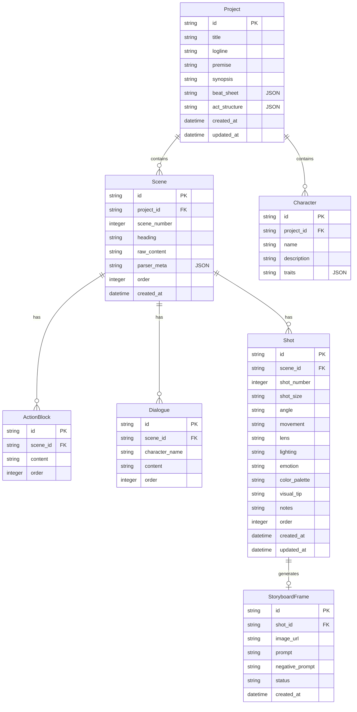

# 70MM AI - MVP Implementation Plan

We are building **70MM AI**, an AI-powered filmmaking workspace, in a 48-hour MVP execution timeframe. The goal is a complete flow: **Idea → Story → Screenplay → Scene Breakdown → Shot Planner → Storyboard → PDF/CSV Export**.

---

## Technical Stack

- **Backend**: FastAPI (Python 3.11) + Uvicorn
- **Database**: SQLite + SQLAlchemy (Async ORM)
- **AI Engines**: Gemini 2.5 Flash (`gemini-2.5-flash`) via REST / SDK
- **Image Generation**: ComfyUI (Flux.1 Dev) with a robust Pillow-based local placeholder fallback
- **Frontend**: Next.js 14 (App Router) + TypeScript + Tailwind CSS + Shadcn UI + Radix UI
- **Drag-and-Drop**: `@dnd-kit/core` + `@dnd-kit/sortable`
- **PDF Generation**: `reportlab`

---

## Proposed Folder Structure

```
p:/70MM ai/
├── backend/
│   ├── app/
│   │   ├── __init__.py
│   │   ├── main.py
│   │   ├── config.py
│   │   ├── database.py
│   │   ├── models.py
│   │   ├── schemas.py
│   │   ├── parser.py
│   │   ├── ai_service.py
│   │   ├── comfy_client.py
│   │   ├── image_service.py
│   │   ├── export_service.py
│   │   ├── workflow.json
│   │   └── routes/
│   │       ├── __init__.py
│   │       ├── projects.py
│   │       ├── scenes.py
│   │       ├── shots.py
│   │       ├── storyboards.py
│   │       └── ai_tools.py
│   ├── requirements.txt
│   ├── Dockerfile
│   └── .env.example
└── frontend/
    ├── app/
    │   ├── layout.tsx
    │   ├── page.tsx
    │   ├── projects/
    │   │   └── page.tsx
    │   └── workspace/
    │       └── [projectId]/
    │           └── page.tsx
    ├── components/
    │   ├── ui/ (Shadcn components)
    │   ├── navbar.tsx
    │   ├── sidebar.tsx
    │   ├── script-editor.tsx
    │   ├── scene-cards.tsx
    │   ├── shot-planner.tsx
    │   ├── storyboard-timeline.tsx
    │   └── theme-provider.tsx
    ├── lib/
    │   ├── api.ts
    │   └── utils.ts
    ├── package.json
    ├── tailwind.config.ts
    └── tsconfig.json
```

---

## Database Schema (SQLAlchemy Models)



---

## Proposed Changes

### Backend Component

#### [NEW] [backend/requirements.txt](file:///p:/70MM%20ai/backend/requirements.txt)
- Defines the backend dependencies:
  - `fastapi`, `uvicorn[standard]`
  - `sqlalchemy`, `aiosqlite`
  - `pydantic`, `pydantic-settings`
  - `google-generativeai`, `httpx`, `websockets`
  - `reportlab` (for PDF exports)
  - `pillow` (for placeholder/local visual generation)
  - `pytest`, `pytest-asyncio`

#### [NEW] [backend/app/database.py](file:///p:/70MM%20ai/backend/app/database.py)
- Configures SQLite async engine and session factory (`sqlite+aiosqlite:///./70mm_ai.db`).
- Creates helper function to initialize database tables.

#### [NEW] [backend/app/models.py](file:///p:/70MM%20ai/backend/app/models.py)
- SQLAlchemy database models for Project, Scene, ActionBlock, Dialogue, Character, Shot, and StoryboardFrame.

#### [NEW] [backend/app/schemas.py](file:///p:/70MM%20ai/backend/app/schemas.py)
- Pydantic models for API request/response validation.

#### [NEW] [backend/app/parser.py](file:///p:/70MM%20ai/backend/app/parser.py)
- Deterministic, non-AI regex parser for `.txt` and `.fountain` scripts.
- Parses scene headings (e.g. `INT. KITCHEN - DAY`), character dialogs, action blocks, and populates database.

#### [NEW] [backend/app/ai_service.py](file:///p:/70MM%20ai/backend/app/ai_service.py)
- Wrapper for Gemini 2.5 Flash using structured output formats (Pydantic models / JSON schema).
- Services:
  - `generate_story_from_idea`: returns premise, synopsis, beat sheet, characters, conflict, act structure.
  - `suggest_scene_formulation`: alternative scene ideas, visual metaphors, conflict suggestions, emotional subtext.
  - `suggest_directors_muse`: 3 cinematic alternatives for a shot (shot size, angle, lens, camera movement, lighting, emotion, palette, visual tip).
  - `build_image_prompt`: builds highly detailed stable diffusion prompts for Flux/ComfyUI.

#### [NEW] [backend/app/comfy_client.py](file:///p:/70MM%20ai/backend/app/comfy_client.py) & [backend/app/image_service.py](file:///p:/70MM%20ai/backend/app/image_service.py)
- ComfyUI API integration wrapper. Connects to `localhost:8188` (default ComfyUI endpoint).
- Includes a fallback image renderer (using Pillow to generate a gorgeous widescreen dark-themed cinematic placeholder overlaying the shot details and prompt) if ComfyUI is not reachable, ensuring the app works standalone.

#### [NEW] [backend/app/export_service.py](file:///p:/70MM%20ai/backend/app/export_service.py)
- PDF generator using `reportlab`. Employs a professional screenplay layout with storyboards, shot lists, and scenes formatted nicely.
- CSV export for shot list sheet.

#### [NEW] [backend/app/routes/](file:///p:/70MM%20ai/backend/app/routes/)
- Implements endpoint routing:
  - `projects.py`: CRUD + script parsing upload.
  - `scenes.py`: Scene listing, detail update, and formulation trigger.
  - `shots.py`: Shot CRUD, ordering, and muse trigger.
  - `storyboards.py`: Image generation, gallery, and export endpoints.

---

### Frontend Component

#### [NEW] [frontend/package.json](file:///p:/70MM%20ai/frontend/package.json)
- Configures frontend workspace dependencies (Next.js, TypeScript, Tailwind, Lucide React, Radix UI, `@dnd-kit/core`).

#### [NEW] [frontend/app/workspace/[projectId]/page.tsx](file:///p:/70MM%20ai/frontend/app/workspace/%5BprojectId%5D/page.tsx)
- The core of the application: a premium resizable split-screen view.
  - **Left Panel**: Script Editor + Parser.
  - **Center Panel**: Scene Cards / Visual Breakdown.
  - **Right Panel**: Shot Planner (editable sortable table).
  - **Bottom Panel**: Storyboard timeline with drag-and-drop.

#### [NEW] [frontend/components/ui/](file:///p:/70MM%20ai/frontend/components/ui/)
- Essential Shadcn components (button, card, dialog, table, input, textarea, slider, scroll-area, toast).

---

## Verification Plan

### Automated Tests
- Create Python unit tests in `backend/tests/` to verify:
  - Screenplay parsing (`parser.py`).
  - Database schema insertion and retrieval.
  - Gemini integration mocks/live endpoints.
  - PDF/CSV generation.

### Manual Verification
- Run backend and frontend locally.
- Walkthrough:
  1. Input a new film idea → Generate full Story Outline.
  2. Write/upload a Fountain script → Parse it into Scenes & Action lines.
  3. Formulate visual breakdowns for a scene.
  4. Generate 3 cinematic options for a shot using Director's Muse.
  5. Generate storyboards (using ComfyUI or Pillow fallback) and view them.
  6. Reorder shots and scenes using Drag and Drop.
  7. Export the final film package as PDF/CSV.
